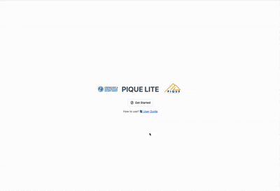

# PIQUE Lite

PIQUE Lite is a lightweight, web-based visualization tool for exploring PIQUE output files.  
A full user guide, feature walkthroughs, and tutorials are available in the documentation:  
👉 https://tool-documentation-demo.netlify.app/docs/pique-lite/intro

## Demo

Below is a short demo of PIQUE Lite:

## Getting Started

1. Install [`bun`](https://bun.sh/)
2. Run `bun install` to install dependencies
3. Run `bun run dev` to start the development server

PIQUE Lite is also accessible through the MSUSEL Tool Hub:  
👉 https://github.com/MSUSEL/MSUSEL_Hub

For development notes and architecture documentation, see:  
👉 [`DEVELOPER_NOTES.md`](./DEVELOPER_NOTES.md)
