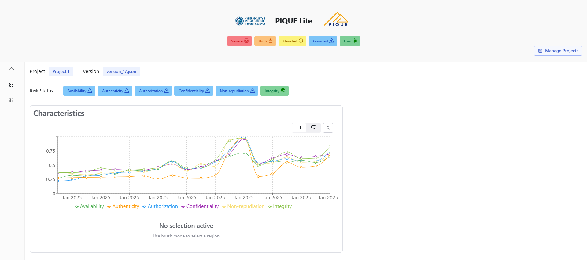

## Introduction
**PIQUE** (Platform for Investigative software Quality Understanding and Evaluation) is a tool designed to help developers, security analysts, and project managers assess and track the security quality of software. By collecting and displaying findings from multiple security analysis tools, PIQUE provides a clear, intuitive way to evaluate software quality.

## Key Features
- **Visualize Software Quality Over Time** – Track how security scores change across different software versions and dates
- **Explore a Hierarchical Breakdown of Security Metrics** – Understand software quality through an interactive tree-based representation
- **Compare Quality Across Categories** – Assess security across multiple aspects, including Availability, Authenticity, Authorization, Confidentiality, Non-repudiation, and Integrity
- **Prioritize Areas for Improvement** – Identify high-risk areas in the software that require immediate attention

## Who is PIQUE for?
PIQUE is designed to support multiple stakeholders:

- **Developers** can analyze security risks in their software and track improvements over time
- **Security Analysts/Researchers** gain insights from multiple security tools to assess vulnerabilities more effectively
- **Project Managers** can review high-level security trends and make informed decisions without deep technical knowledge

## Customization and Advanced Features
PIQUE allows users to customize quality assessments to fit their needs. Users can adjust the weights of the six core quality aspects: Availability, Authenticity, Authorization, Confidentiality, Non-repudiation, and Integrity. This gives stakeholders control over how security scores are calculated so evaluations match their priorities and risk tolerance.

## Next Steps
The [User Guide](user-guide/index.md) will walk you through how to interact with PIQUE’s features, interpret results, and make informed decisions based on security quality assessments.