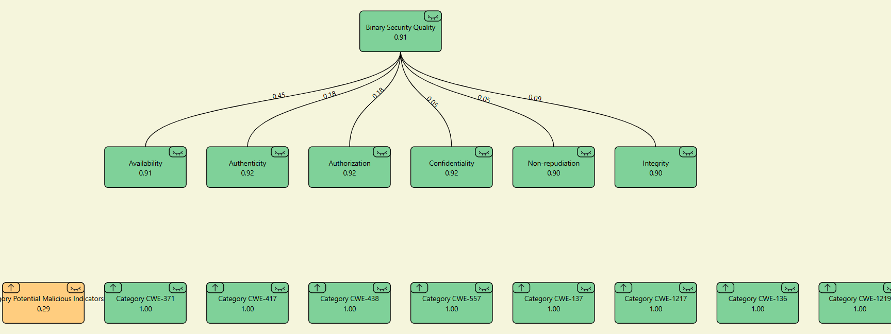
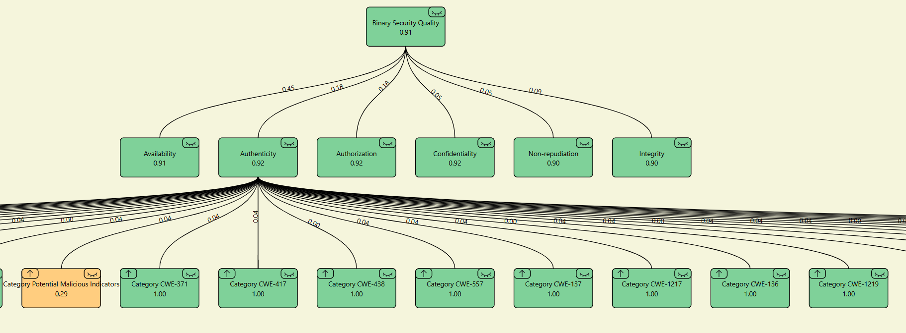
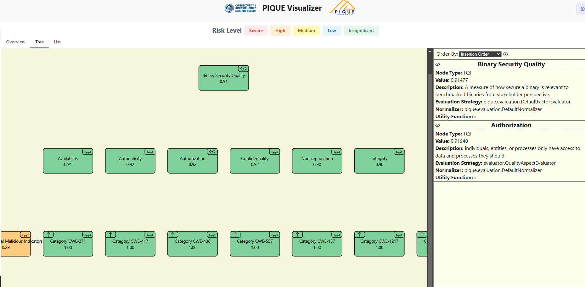
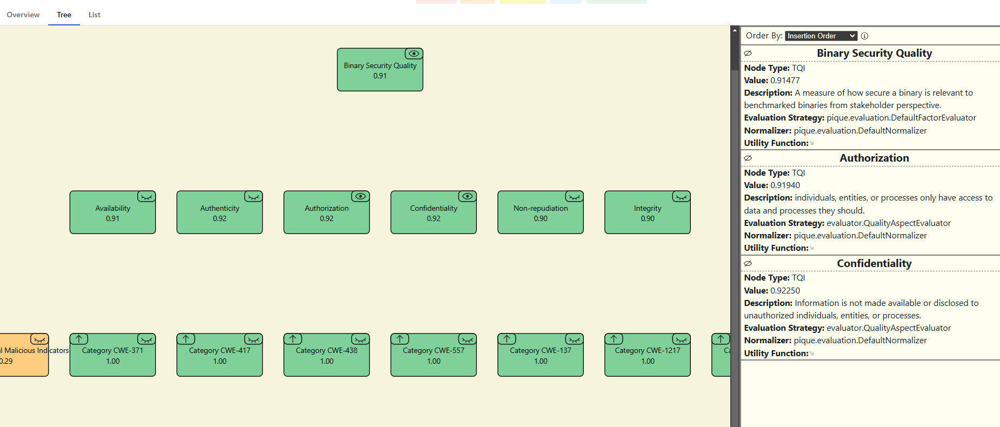
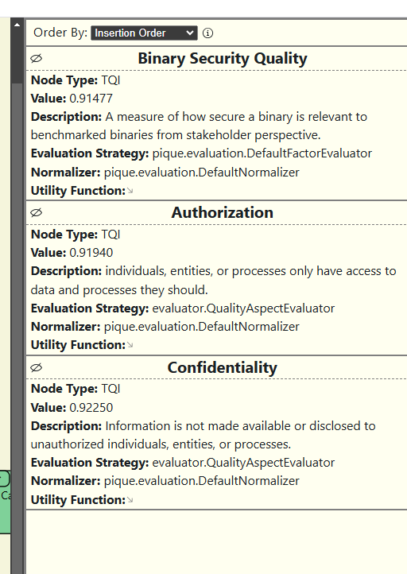

# Hierarchical Tree Display  

The **Hierarchical Tree Display** helps visualize data in a structured way. Each node represents a component, with subnodes branching out to show relationships.  

## How It Works  

### Interacting with Nodes  
- **Click a node** to reveal lines connecting it to its subnodes, along with percentage values  
- **Press the eye button** in the sidebar to see detailed info, including the node’s score

### Visual Elements  
- Nodes connect with lines to show relationships
- Each node has a **score** and subnodes display **percentage values** to show their contribution
- Clicking a node expands its structure for better visibility

## Example Views  

### Single-Level  
Press a node to see its percentage distribution from its children.

### Multi-Level   

### Node Details Sidebar  
Press the **eye button** in the sidebar to see more details about a node, including its score.  
 

 

 

