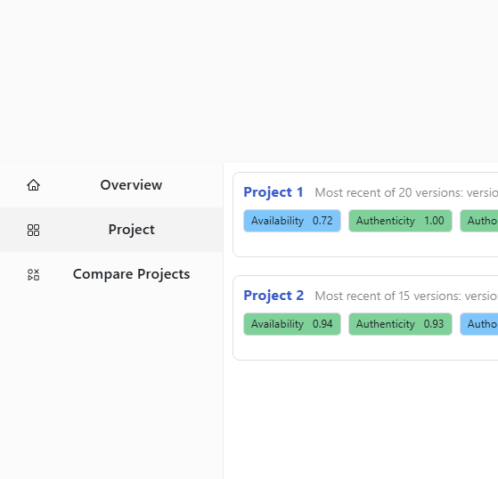
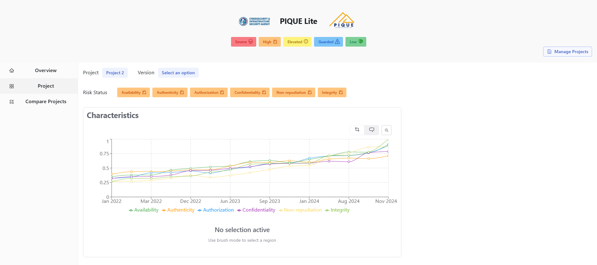
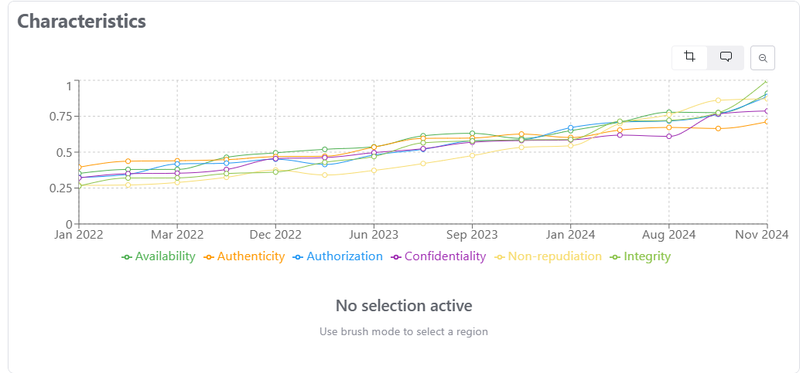
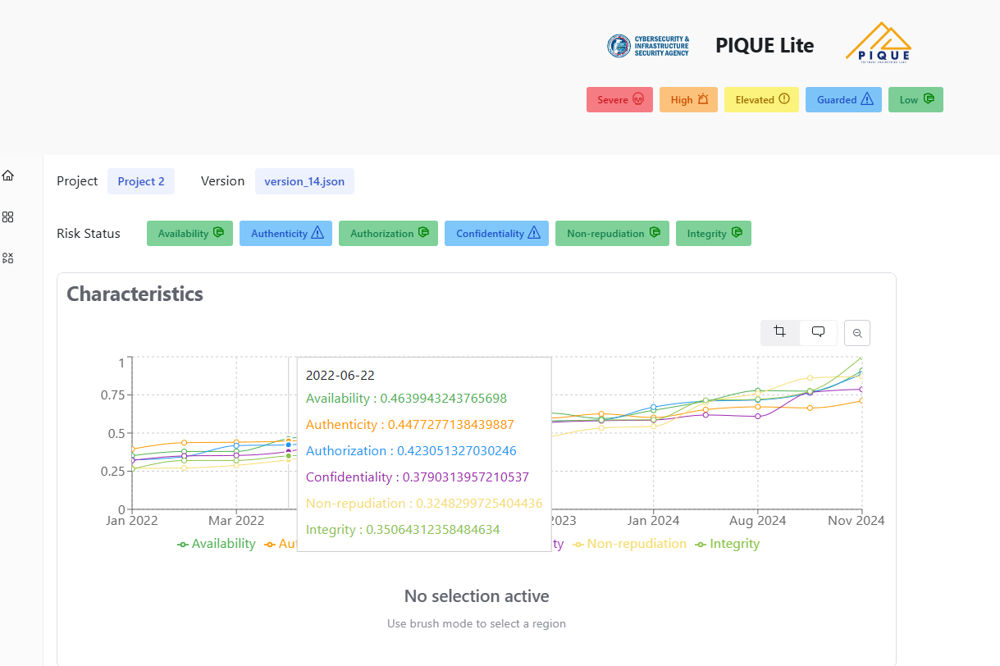
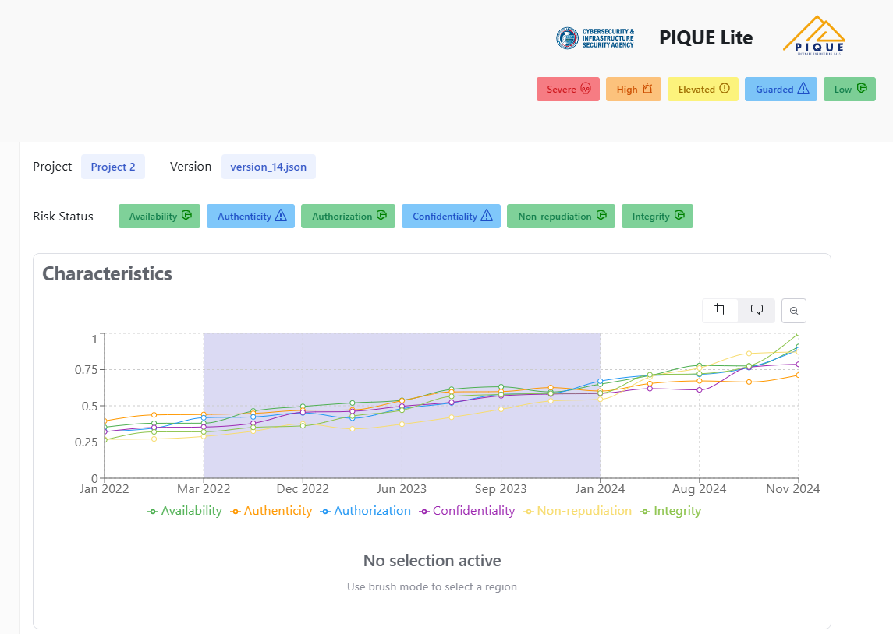
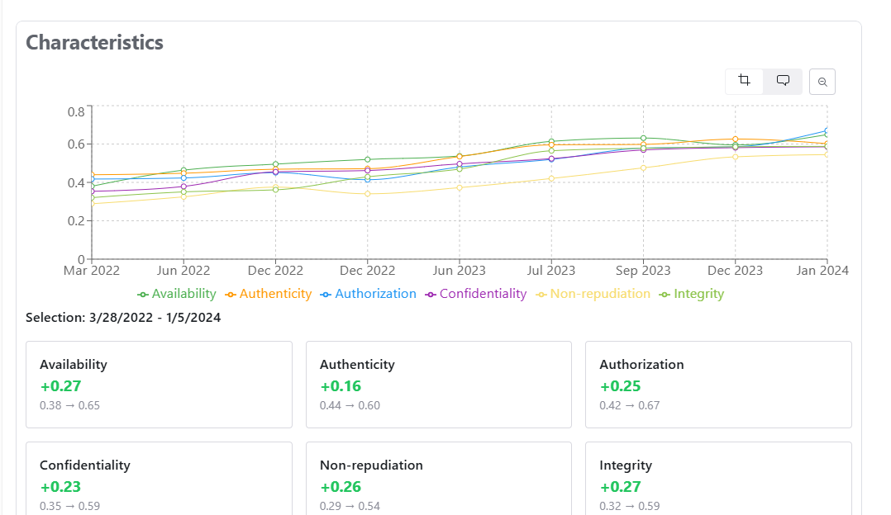
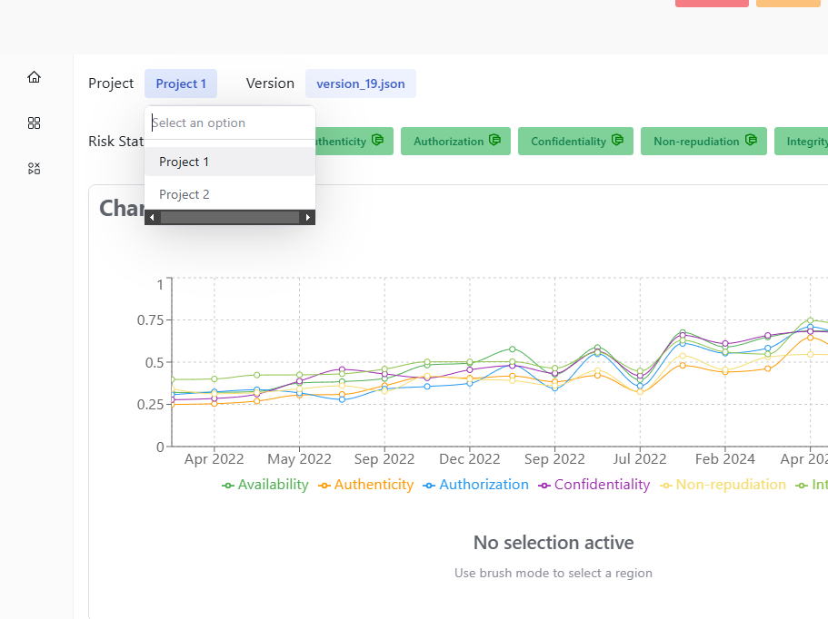
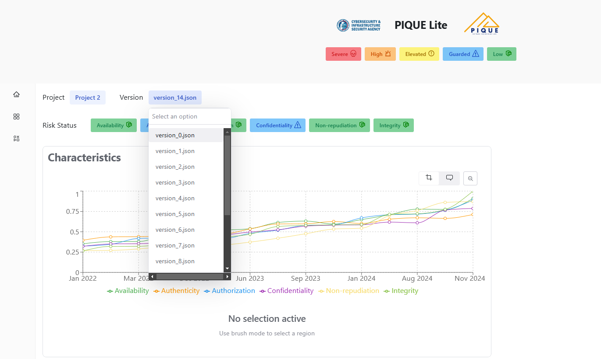

The **Project Characteristics** page visualizes quality changes over time.

## Navigating to the Characteristics Page

To access this page, click on the **Project** tab in the navigation bar.  

## Understanding the Graph

This page visualizes how the six quality aspects evolve over different versions of a project. 

The graph displays six colored lines each representing a quality aspect.

## Interacting with the Graph

### Hover for Detailed Information

- Move your mouse over any version to see the **TQI** and scores for all six aspects

### Zoom & Crop Feature

- Select a range of versions to zoom in and analyze quality trends more closely
- Click the **Zoom Out Magnifier** button to return to the full graph view

**Zoom results**:

## Selecting Projects & Versions  

Above the graph, you can:  

- **Select a project** from the dropdown to load its data

- **Choose a specific version** to display its **exact quality scores** above the graph.

