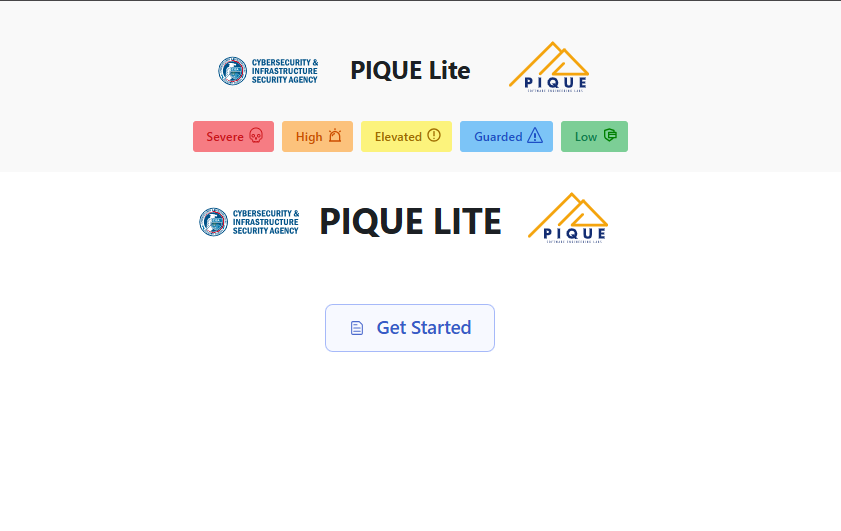
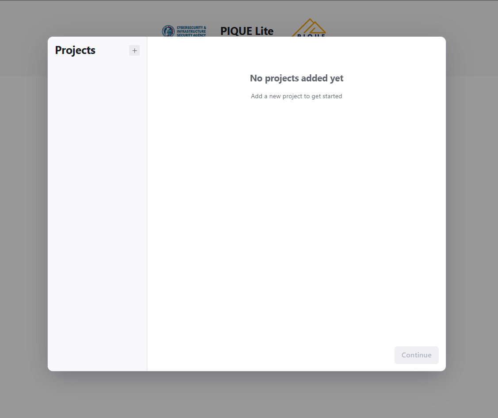
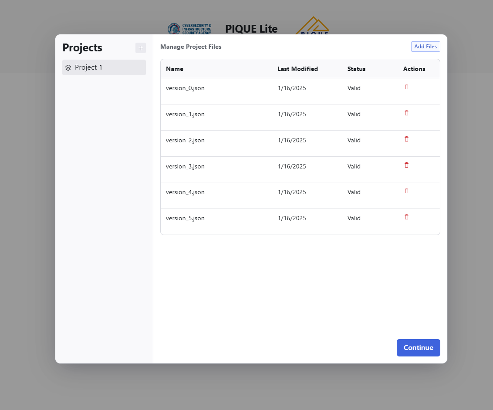
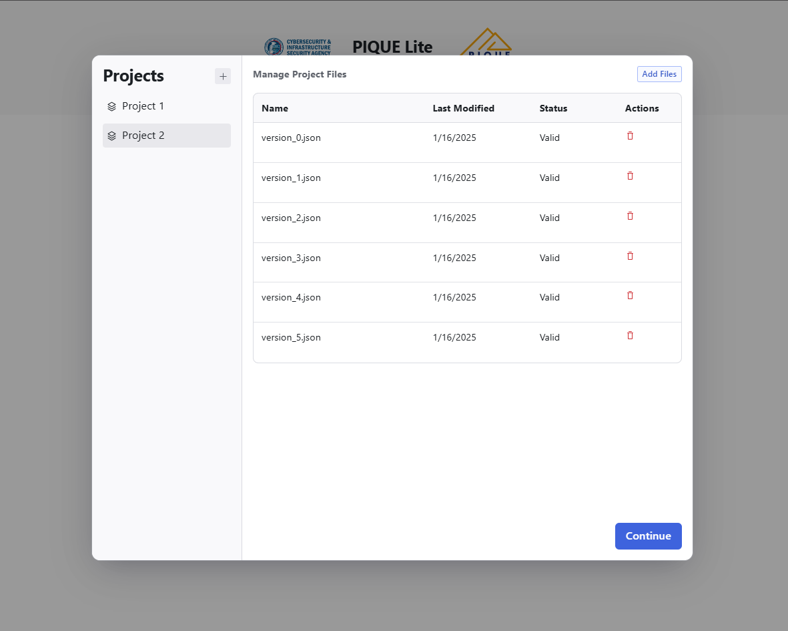

# Uploading and Managing Files  

PIQUE allows you to upload and manage files for different versions of your project. You can compare multiple projects, hide files you don’t need, and filter or search for specific files. This guide will walk you through the process.

## Uploading Files
To upload a file:

1. Click the **+** button to add a project

2. Click the **Add Files** button
3. Select the JSON files from your computer

## Adding Multiple Projects
You can upload files for multiple projects to compare their quality scores. To add a new project:

1. Click the **+** button to add an additional project
2. Click the **Add Files** button
3. Select the JSON files from your computer

## Adding Files for Different Versions
To track changes over time, upload files for different versions of the same project. We recommend including the version number or date in the file's name.

## Hiding Files
If your file list becomes cluttered, you can hide files temporarily:

1. Click the **Hide** icon next to the file you want to hide
2. To view hidden files, enable the **Show Hidden Files** option

**ADD IMAGE ONCE FEATURE IS COMPLETED**

## Searching for Files
To find a specific file:

1. Use the **Search** bar at the top of the page
2. Enter the project name, version, or any other identifier
3. The list will filter automatically as you type

## Filtering Files
You can filter files to focus on specific projects or versions:

1. Click the **Filter** button
2. Select the criteria (e.g., project name, version, date)
3. The file list will update to show only matching files

## Error Messages
If you encounter an error during upload, refer to the [Input Errors](../input-schema/input-errors.md) page for troubleshooting steps. 