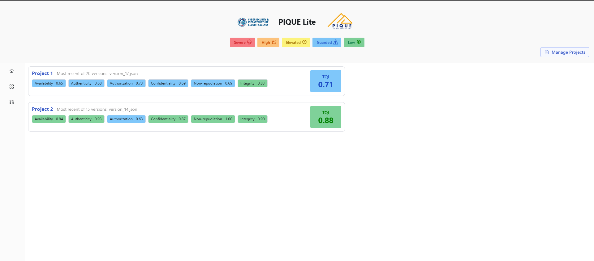
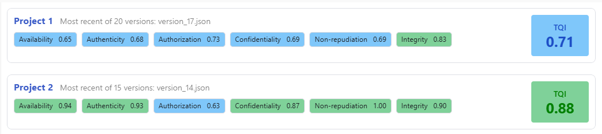
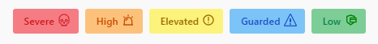
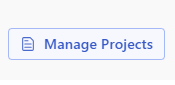
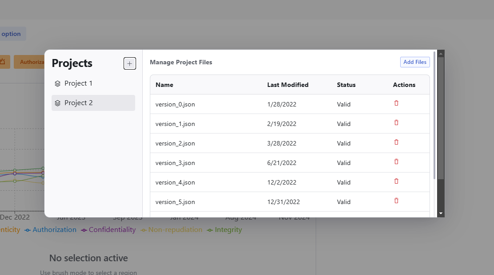

## Introduction

Each project input displays a Total Quality Index (TQI) along with quality scores for six key aspects of software security:

| Quality Aspect     | Definition                                                                       | Opposing Threat           |
|--------------------|----------------------------------------------------------------------------------|---------------------------|
| **Availability**   | Ensures the system remains operational and accessible when needed                | Denial of service         |
| **Authenticity**   | Verifies that data, users, and systems are genuine and not tampered with         | Spoofing                  |
| **Authorization**  | Controls access permissions to ensure only authorized users can perform actions  | Escalation of privileges  |
| **Confidentiality**| Protects sensitive data from unauthorized access or disclosure                   | Information disclosure    |
| **Non-repudiation**| Ensures actions or transactions cannot be denied after execution                 | Repudiation               |
| **Integrity**      | Maintains accuracy and consistency of data over its lifecycle                    | Tampering                 |

The TQI provides a composite measure of overall software quality, while the individual quality scores highlight specific security areas.

## Risk Level Indicators

Each quality aspect is assigned a risk level based on its score:

- **Red:** Severe risk
- **Orange:** High risk
- **Yellow:** Elevated risk
- **Blue:** Guarded risk
- **Green:** Low risk

A legend is provided on the dashboard to help you interpret these color codes.

## Managing Projects  

On the far right of the screen, you’ll see the **Manage Project** button 

- Click this to edit, update, or remove uploaded projects and files

