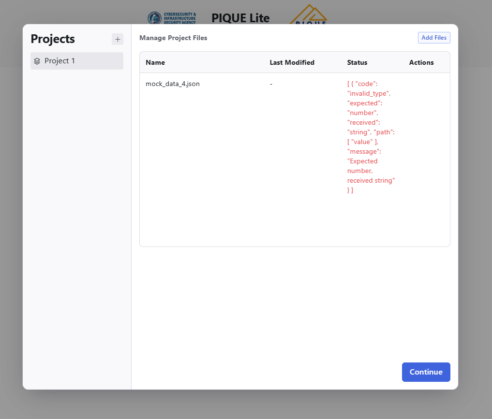

If the input JSON file is invalid, PIQUE Visualizer will display an error message. Below is an example of what you might see:

## Common Causes of Errors
1. **Missing Required Fields**: Ensure all required fields (`name`, `factors`, `measures`, `diagnostics`) are present
2. **Incorrect Data Types**: Verify that each field matches the expected type (e.g., `name` as a string, `factors` as an object)
3. **Invalid JSON Syntax**: Check for mismatched brackets, missing commas, or improperly quoted strings
4. **Referential Integrity Issues**: Ensure measures reference valid diagnostics and factors reference valid measures

## Troubleshooting Steps
1. **Validate JSON Syntax**: Use a JSON validator (e.g., <a href="https://jsonlint.com/" target="_blank" rel="noopener noreferrer">JSONLint</a>) to check for syntax errors
2. **Check Field Names**: Ensure all field names are spelled correctly and match the expected format
3. **Review Data Types**: Confirm that numeric values are numbers, strings are quoted, and objects are properly structured
4. **Regenerate File**: Regenerate the JSON file if all else fails